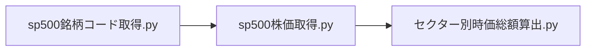

# ペアトレード
## ファイル構成
### Data-Visualization.ipynb: データ可視化用のJupyter Notebook
株式データの特徴を可視化するためのJupyter Notebook。
### sp500銘柄コード取得.py: sp500銘柄コード取得
現時点でのsp500銘柄コードを取得。
### sp500株価取得.py: sp500銘柄の株価取得
sp500銘柄コードを元に、株価を取得。
### セクター別時価総額算出.py: sp500銘柄のセクター別時価総額算出
sp500銘柄のセクター別時価総額を算出。
### ペアトレード戦略シミュレーション.ipynb: ペアトレード戦略シミュレーション
ペアトレード戦略のシミュレーションを行う。

## SP500セクター別時価総額割合算出

### 概要

### 実行順序

# S&P500終値-取引高拡張モデル
## ファイル構成
### SP500指数取得&可視化.ipynb: S&P500指数取得&可視化
### sp500データ2次元拡張モデル.ipynb: sp500データ2次元拡張モデル
S&P500種指数の終値と取引高のヒストリカルデータを1-20日前からの騰落率を特徴量として、2次元拡張モデルを構築した。
1-20日後の終値の騰落の正負判別をLightGBMで予測する。

## 実行順序

### 考察
特徴量に過去の終値と取引高の騰落率を用いることで、パターン認識を行えるのではないかと考え、時系列分析ではなくクロスセクション分析の手法を用いてモデルを構築した。
そのため、ダウンサンプリングを行い、学習データに偏りを生じさせないようにする事を行ったた。
予測精度としては概ね50%を超える精度を出すことができましたが、buy&holdと比較すると、収益性は劣る結果となった。