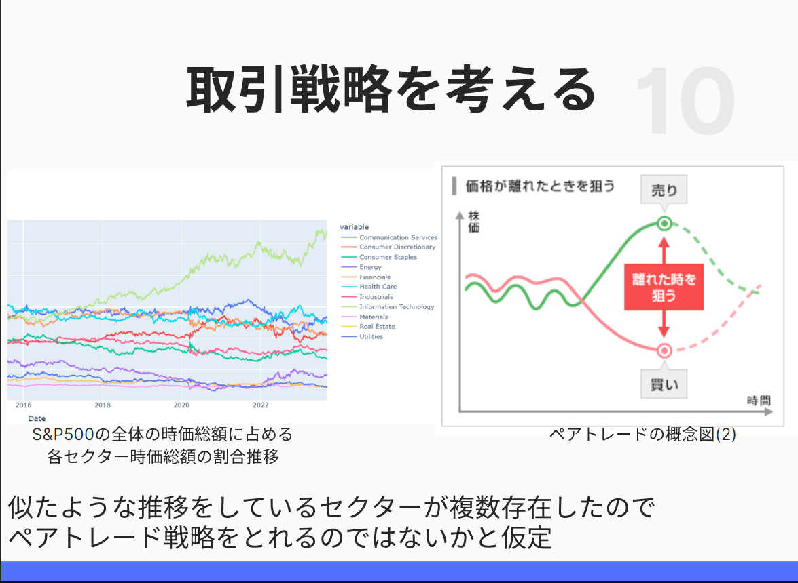

# ファイル説明
## Data-Visualization.ipynb: データ可視化用のJupyter Notebook
株式データの特徴を可視化するためのJupyter Notebookです。
## sp500銘柄コード取得.py: sp500銘柄コード取得
現時点でのsp500銘柄コードを取得します。
## sp500株価取得.py: sp500銘柄の株価取得
sp500銘柄コードを元に、株価を取得します。
## セクター別時価総額算出.py: sp500銘柄のセクター別時価総額算出
sp500銘柄のセクター別時価総額を算出します。
## ペアトレード戦略シミュレーション.ipynb: ペアトレード戦略シミュレーション
ペアトレード戦略のシミュレーションを行います。

# SP500セクター別時価総額割合算出

## 概要

## 実行順序

